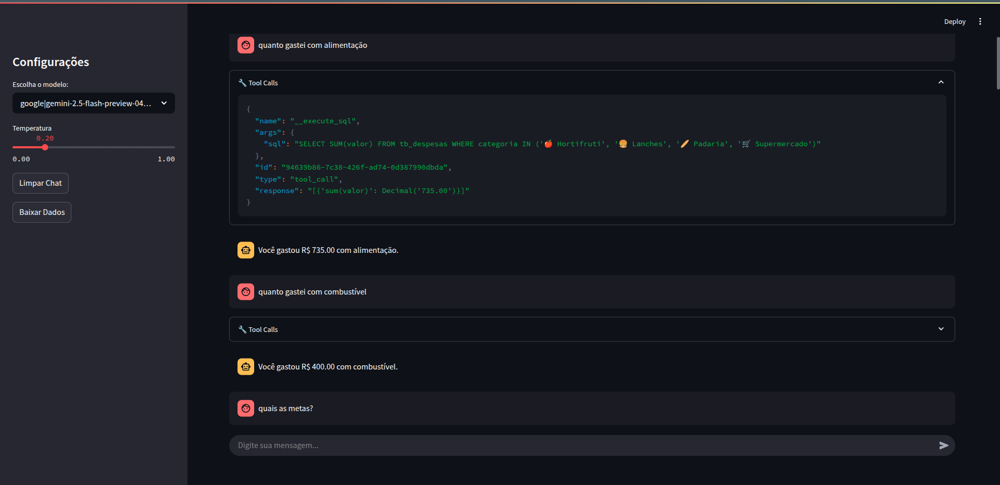

# Chatbot Financeiro - LangGraph Finances Agent

[](https://www.apache.org/licenses/LICENSE-2.0)
[](https://www.python.org/downloads/)
[](https://docs.docker.com/compose/)



## Sumário
- [Visão Geral](#visão-geral)
- [Pré-requisitos](#pré-requisitos)
- [Configuração](#configuração)
  - [Local](#opção-1-configuração-local)
  - [Docker](#opção-2-configuração-com-docker)
- [Uso](#uso)
  - [Sem Docker](#iniciar-com-streamlit)
  - [Com Docker](#executando-com-docker)
- [Funcionalidades](#funcionalidades)
- [Exemplos de Perguntas](#exemplos-de-perguntas)
- [Estrutura do Projeto](#estrutura-do-projeto)
- [Modelos Suportados](#modelos-suportados)
- [Contributing](#contributing)
- [Troubleshooting](#troubleshooting)
- [Demonstração](#demonstração)
- [Licença](#licença)

## Visão Geral

Um assistente financeiro baseado em IA para gerenciar e consultar suas finanças pessoais. Este projeto utiliza LangGraph, DuckDB e integração com Google Sheets para fornecer um chatbot interativo que responde a perguntas sobre finanças pessoais.

Este projeto cria um agente de IA que:
- Realiza consultas de dados financeiros através de linguagem natural
- Conecta-se à uma planilha do Google Sheets para obter dados
- Armazena e consulta dados usando DuckDB
- Fornece uma interface web interativa com Streamlit

Link da planilha Google utilizada como exemplo para obter os dados: [Planilha de Finanças](https://docs.google.com/spreadsheets/d/10JLZYfMoOpOpM1_53QnpeYR3jCngZjMSMPtyFwbFIbw/edit?usp=sharing)

## Pré-requisitos

- Python 3.12 ou superior
- Acesso ao Google Sheets API
- Credenciais para o Google Sheets API
- API key para os modelos de LLM (Groq, Google Gemini ou Ollama local)
- Docker 24.0+ e Docker Compose 3.0+ (para execução containerizada)

## Configuração

### 1. Ambiente de Desenvolvimento

Você pode escolher entre configurar um ambiente local ou utilizar Docker para execução do projeto.

#### Opção 1: Configuração Local

```bash
# Clone o repositório
git clone [url-do-repositorio]
cd scoras-academy-langgraph-finances-agent

# Método 1: Instalação com pip
python -m venv venv
source venv/bin/activate  # No Windows: venv\Scripts\activate

# Instale as dependências
pip install -e .

# Método 2: Instalação com UV (recomendado - mais rápido)
curl -LsSf https://astral.sh/uv/install.sh | sh
uv sync
```

#### Opção 2: Configuração com Docker

Esta é a maneira mais simples de começar, pois todos os requisitos são gerenciados automaticamente:

```bash
# Clone o repositório
git clone [url-do-repositorio]
cd scoras-academy-langgraph-finances-agent

# Configure as credenciais (veja seção 2 abaixo)
# Certifique-se de que os arquivos credentials.json e .env estejam na pasta raiz
```

### 2. Configuração das Credenciais

#### Configuração do arquivo .env

O projeto requer algumas variáveis de ambiente para funcionar corretamente. Siga os passos abaixo para configurá-las:

1. Crie uma cópia do arquivo de exemplo:

```bash
cp .env.example .env
```

2. Abra o arquivo .env em um editor de texto:

```bash
nano .env  # ou use qualquer editor de sua preferência
```

3. Preencha as variáveis de ambiente:

```
GROQ_API_KEY=sua_chave_da_api_groq
SPREADSHEET_ID=id_da_sua_planilha_google
GOOGLE_API_KEY=sua_chave_da_api_google
```

Onde:
- `GROQ_API_KEY`: Obtenha em [Groq Console](https://console.groq.com/keys)
- `SPREADSHEET_ID`: É o ID da sua planilha do Google (encontrado na URL após /d/ e antes de /edit)
- `GOOGLE_API_KEY`: Obtenha no [Google Cloud Console](https://console.cloud.google.com/apis/credentials)

#### Configuração do Google Sheets

1. Configure as credenciais do Google Sheets:
   - Acesse o [Google Cloud Console](https://console.cloud.google.com/)
   - Crie um projeto (ou selecione um existente)
   - Ative a API do Google Sheets
   - Crie uma conta de serviço
   - Baixe o arquivo JSON de credenciais
   - Renomeie o arquivo para `credentials.json` e coloque-o na raiz do projeto
   - Compartilhe sua planilha com o email da conta de serviço

## Uso

### Iniciar com Streamlit

```bash
streamlit run src/app.py
```

A aplicação estará disponível em http://localhost:8501

### Executando com Docker

O projeto inclui um Dockerfile e docker-compose.yml para fácil implantação:

```bash
# Construir e iniciar o container
docker-compose up -d

# Verificar os logs
docker-compose logs -f

# Parar o container
docker-compose down
```

Certifique-se de que os arquivos `credentials.json` e `.env` estejam na pasta raiz antes de executar os comandos acima.

O Docker usa o gerenciador de pacotes UV para uma instalação mais rápida das dependências.

## Funcionalidades

- **Chatbot Interativo**: Faça perguntas em linguagem natural sobre seus dados financeiros
- **Baixar Dados**: Atualize seus dados a partir do Google Sheets
- **Escolha de Modelo**: Selecione entre diferentes modelos de LLM para alimentar o chatbot
- **Consultas Avançadas**: Realize perguntas complexas sobre suas finanças

### Exemplos de Perguntas

- "Qual o saldo atual das minhas contas?"
- "Quanto gastei em Alimentação no último mês?"
- "Qual é o meu orçamento para o próximo trimestre?"
- "Como estão minhas metas financeiras?"

## Estrutura do Projeto

- `src/app.py`: Aplicação Streamlit principal
- `src/graph_manager.py`: Gerenciamento do grafo LangGraph
- `src/duckdb_manager.py`: Gerenciamento do banco de dados DuckDB
- `src/google_sheets_manager.py`: Integração com Google Sheets
- `table_mapping.json`: Mapeamento das tabelas e colunas

## Modelos Suportados

- Ollama (local): qwen2.5:7b, granite3.3:8b, cogito:8b
- Google Gemini: gemini-2.5-pro-exp, gemini-2.5-flash-preview
- Groq: llama3-70b-8192, llama-4-scout-17b, llama-4-maverick-17b

## Contributing

Contribuições são bem-vindas! Para contribuir, siga:

1. Fork deste repositório
2. Crie uma branch: `git checkout -b feature/nova-funcionalidade`
3. Realize suas alterações e commite: `git commit -m "Adicionar nova funcionalidade"`
4. Envie para o repositório remoto: `git push origin feature/nova-funcionalidade`
5. Abra um Pull Request

Por favor, siga as práticas de codificação e testes antes de submeter.

## Troubleshooting

- Erro de credenciais: Verifique se `credentials.json` e `.env` existem na raiz e têm permissões corretas.
- Porta em uso: Caso a porta 8501 esteja ocupada, passe `--server.port <outra_porta>` ao `streamlit run`.
- Problemas de dependências: Remova o diretório `venv` e refaça a instalação ou reconstrua o container Docker.

## Demonstração

Clique na imagem abaixo para assistir ao vídeo de demonstração:

[](docs/video.webm)

## Licença

Este projeto é licenciado sob a Licença Apache 2.0. Para mais detalhes, consulte o arquivo [LICENSE](LICENSE) ou visite [Apache License 2.0](https://www.apache.org/licenses/LICENSE-2.0).